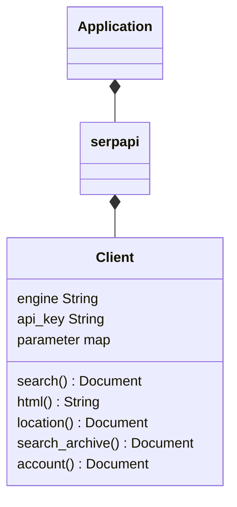

<div align="center">
<h1 align="center">SerpApi C++ Library</h1>

[](https://github.com/serpapi/serpapi-cpp/actions/workflows/ci.yml)
</div>

Integrate search data into your C++ application. This library is the official wrapper for [SerpApi](https://serpapi.com).

SerpApi supports Google, Google Maps, Google Shopping, Baidu, Yandex, Yahoo, eBay, App Stores, and more.

## Installation

C++17 and meson are required.

### Installation from Release

Download the latest source package from the [GitHub Releases](https://github.com/serpapi/serpapi-cpp/releases) page, then run:

```bash
tar xf serpapi-0.3.0.tar.xz
cd serpapi-0.3.0
meson setup build
meson compile -C build
sudo meson install -C build
```

### Meson Dependency

Add the dependency to your `meson.build`:

```meson
serpapi_dep = dependency('serpapi')
```

Or if you are using it as a subproject:

```meson
serpapi_proj = subproject('serpapi')
serpapi_dep = serpapi_proj.get_variable('libserpapi_dep')
```

[SerpApi C++](https://github.com/serpapi/serpapi-cpp)

## Simple Usage

```cpp
#include <iostream>
#include <map>
#include <string>
#include <serpapi.hpp>
#include <rapidjson/document.h>
#include <rapidjson/stringbuffer.h>
#include <rapidjson/prettywriter.h>

int main() {
    const char* env_p = std::getenv("SERPAPI_KEY");
    if (!env_p) return 1;

    std::string apiKey(env_p);
    std::map<std::string, std::string> default_parameter;
    default_parameter["api_key"] = apiKey;
    default_parameter["engine"] = "google";

    serpapi::Client client(default_parameter);

    std::map<std::string, std::string> parameter;
    parameter["q"] = "coffee";
    parameter["location"] = "Austin,TX";

    rapidjson::Document d = client.search(parameter);

    rapidjson::StringBuffer buffer;
    rapidjson::PrettyWriter<rapidjson::StringBuffer> writer(buffer);
    d.Accept(writer);
    std::cout << "\nINFO: " << buffer.GetString() << std::endl;
    return 0;
}
```

This example runs a search for "coffee" on Google. It then returns the results as a RapidJSON Document. See the [playground](https://serpapi.com/playground) to generate your own code, or check out our [local examples](example/).

## Advanced Usage
### Search API
```cpp
#include <serpapi.hpp>

// serpapi client created with default parameters
std::map<std::string, std::string> default_params = {
    {"api_key", "secret_key"},
    {"engine", "google"}
};
serpapi::Client client(default_params);

// search query overview (more fields available depending on search engine)
std::map<std::string, std::string> params = {
  {"engine", "google"},
  {"q", "Coffee"},
  {"location", "Portland,Oregon,United States"},
  {"device", "desktop"},
  {"hl", "en"},
  {"gl", "us"}
};

// formatted search results as a RapidJSON Document
rapidjson::Document results = client.search(params);

// raw search engine html as a String
std::string raw_html = client.html(params);
```

[Google search documentation](https://serpapi.com/search-api).

#### Documentation

 * [Full documentation on SerpApi.com](https://serpapi.com)
 * [Library Github page](https://github.com/serpapi/serpapi-cpp)
 * [Google Search example](example/google_example.cpp)
 * [Integration test (OOBT) example](oobt/main.cpp)
 * [API health status](https://serpapi.com/status)

### Location API

```cpp
std::map<std::string, std::string> default_parameter = {};
serpapi::Client client(default_parameter);
std::map<std::string, std::string> parameter;
parameter["limit"] = "3";
parameter["q"] = "Austin";

rapidjson::Document doc = client.location(parameter);
const rapidjson::Value& list = doc.GetArray();

rapidjson::StringBuffer buffer;
rapidjson::PrettyWriter<rapidjson::StringBuffer> writer(buffer);
list.Accept(writer);
std::cout << buffer.GetString() << std::endl;
```

It prints the first 3 locations matching Austin (Texas, Texas, Rochester).

NOTE: api_key is not required for this endpoint.

### Search Archive API

This API allows retrieving previous search results.

```cpp
serpapi::Client client({{"api_key", "secret_api_key"}, {"engine", "google"}});
rapidjson::Document results = client.search({{"q", "Coffee"}, {"location", "Portland"}});
std::string search_id = results["search_metadata"]["id"].GetString();

// Now let's retrieve the previous search results from the archive.
rapidjson::Document archived_results = client.search_archive(search_id);
```

### Account API
```cpp
serpapi::Client client({{"api_key", "secret_api_key"}});
rapidjson::Document account_info = client.account();
```

## Advanced search API usage

Search API features non-blocking search using the option: `async=true`.
 - Non-blocking - async=true - a single parent process can handle unlimited concurrent searches.
 - Blocking - async=false - processes must wait for the HTTP response.

### Example: Asynchronous searches

```cpp
#include <serpapi.hpp>
#include <rapidjson/document.h>
#include <iostream>

int main() {
    serpapi::Client client({{"api_key", "YOUR_API_KEY"}, {"engine", "google"}});

    std::map<std::string, std::string> parameter;
    parameter["q"] = "coffee";
    parameter["async"] = "true";

    rapidjson::Document d = client.search(parameter);
    std::string id = d["search_metadata"]["id"].GetString();

    // You can later retrieve the results using search_archive
    rapidjson::Document results = client.search_archive(id);
    return 0;
}
```

## Supported C++ version.
C++ versions validated by Github Actions:
 - C++17
 - C++20

## Change logs
 * [2026-02-12] 0.3.0 Refactor and cleanup.
 * [2026-01-06] 0.2.0 Release package with meson build system.
 * [2023-02-20] 0.1.0 Full API support

## Developer Guide
### Key goals
 - Brand centric instead of search engine based
 - Simple HTTP client (lightweight, reduced dependency)
 - Easy extension
 - Defensive code style
 - TDD
 - KiSS principles

### Code quality expectations
 - 0 lint offense: `rake lint`
 - 100% tests passing: `rake test`
 - 100% code coverage: `rake coverage`

## Design : UML diagram
### Class diagram


## Continuous integration
We use GitHub Actions for continuous integration.

Set your secret API key in your shell before running tests.
```bash
export SERPAPI_KEY="your_secret_key"
```

Check code quality using Lint.
```bash
rake lint
```

Run tests.
```bash
rake test
```

## Run with Docker

```bash
env SERPAPI_KEY=SERPAPI_KEY docker run --rm -it -e SERPAPI_KEY --workdir /tmp/serpapi -v $PWD:/tmp/serpapi conanio/gcc10 make install_linux reset all
```

## Get started.
 - Set an environment SERPAPI_KEY=<secret>
 - Install dependencies:
    - `rake install:apple`
    - `rake install:linux`
 - Initialize the project: `rake setup`
 - Build: `rake build`
 - Run examples: `rake example`

 # Documentation
https://formulae.brew.sh/formula/googletest
https://rapidjson.org/md_doc_tutorial.html

